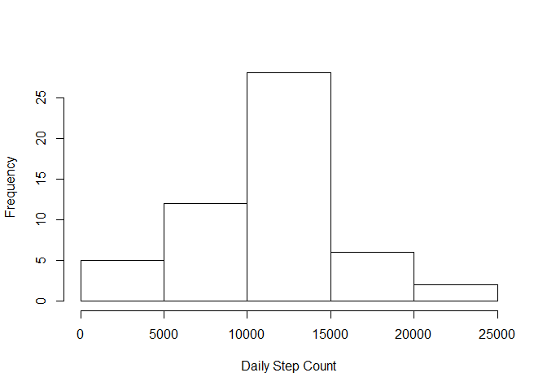
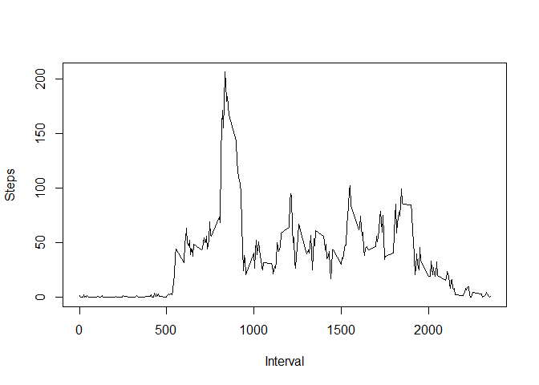
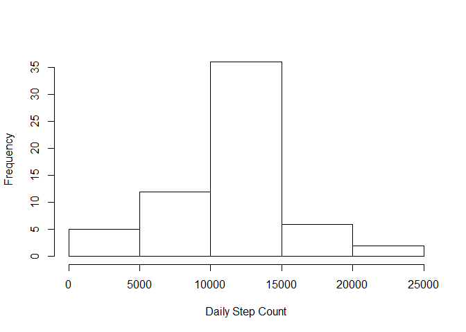
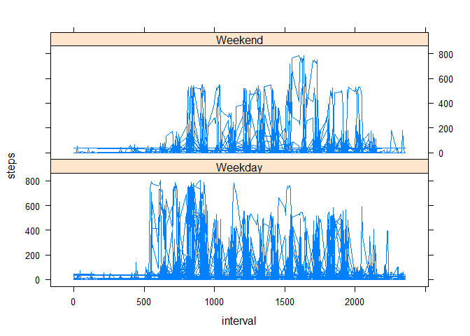

# Reproducible Research: Peer Assessment 1


## Loading and preprocessing the data


```r
setwd("C:/Projects/Coursera/RepResearch/repdata-data-activity")
activity <- read.csv("activity.csv", header=TRUE, sep=",")
```


## What is mean total number of steps taken per day?


```r
dailyStepCount <- aggregate(steps ~ date , data = activity, sum, na.rm =TRUE)
StepCounts <- hist(dailyStepCount$steps, xlab="Daily Step Count", main="")
```

 

```r
mean(dailyStepCount$steps)
```

```
## [1] 10766.19
```

```r
median(dailyStepCount$steps)
```

```
## [1] 10765
```


## What is the average daily activity pattern?

```r
IntervalAvg <- aggregate(steps ~ interval, data = activity, FUN=mean)

plot(IntervalAvg$interval, IntervalAvg$steps, type="l", xlab="Interval", ylab="Steps")
```

 

```r
IntervalAvg[IntervalAvg$steps== max(IntervalAvg$steps),]
```

```
##     interval    steps
## 104      835 206.1698
```


## Imputing missing values

```r
sum(is.na(activity$steps))
```

```
## [1] 2304
```

```r
sum(is.na(activity$date))
```

```
## [1] 0
```

```r
sum(is.na(activity$interval))
```

```
## [1] 0
```

```r
CleanActivity <- activity
CleanActivity$steps[is.na(CleanActivity$steps)] <- mean(CleanActivity$steps, na.rm=TRUE)

dailyStepClean <- aggregate(steps ~ date , data = CleanActivity, sum, na.rm =TRUE)
StepCountsClean <- hist(dailyStepClean$steps, xlab="Daily Step Count", main="")
```

 

```r
mean(dailyStepClean$steps)
```

```
## [1] 10766.19
```

```r
median(dailyStepClean$steps)
```

```
## [1] 10766.19
```
Imputing the missing data caused the median to increase & is now equal to the mean.

## Are there differences in activity patterns between weekdays and weekends?

```r
CleanActivity$date <- as.Date(CleanActivity$date, "%Y-%m-%d")
CleanActivity$dayofweek <- weekdays(CleanActivity$date, abbreviate=FALSE)

CleanActivity$workday <- ifelse(  CleanActivity$dayofweek == "Monday"
                                | CleanActivity$dayofweek == "Tuesday"
                                | CleanActivity$dayofweek == "Wednesday"
                                | CleanActivity$dayofweek == "Thursday"
                                | CleanActivity$dayofweek == "Friday"
                                , "Weekday","Weekend")
                                
CleanActivity$workday <- as.factor(CleanActivity$workday)

library(lattice)
xyplot(steps ~ interval | workday, data = CleanActivity, layout = c(1, 2), type="l")        
```

 

